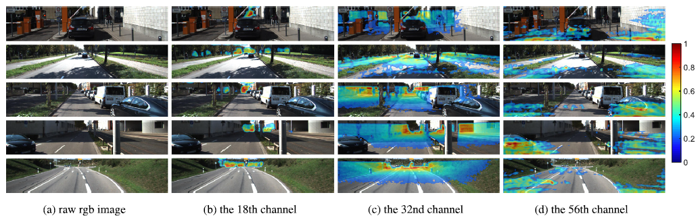
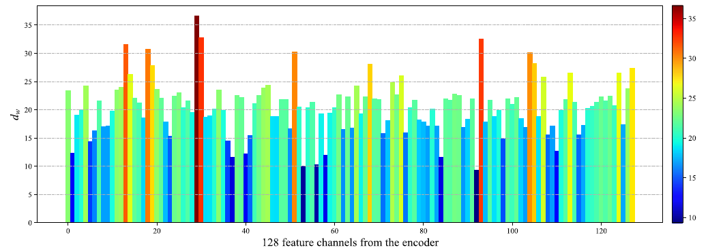

# SCNet
Implementation of our paper entitiled [S&CNet: A lightweight network for fast and accurate depth completion](https://www.sciencedirect.com/science/article/abs/pii/S1047320321001450) published in JVCI. This code is mainly based on [Sparse-Depth-Completion](https://github.com/wvangansbeke/Sparse-Depth-Completion). Thanks for their provided codes.

In this paper, we interestingly found that, for deep learning-based depth completion, each feature channel generated by the encoder network corresponds to a different depth range. It can be shown in below:
<div align=center>
  
</div>

We can clearly see that the 18th channel of the feature map responds to long-distance objects, the 32 feature map responds to middle-distance objects and the 56th responds to near objects. We also proposed a more scientific metric to demonstrate this new finding. We define a weighted depth value *dw* to represent the depth range that a feature channel corresponds to. Then we can see the distributions of *dw* across different feature channels:
<div align=center>
  
</div>


## 1. Get Started
### a. Test environment:
```shell script
Ubuntu 16.04
Python 3.7
Pytorch 1.7
```
### b. Install:
```shell script
pip install opencv-python pillow matplotlib
```
## 2. Datasets
### a. KITTI dataset
The [Kitti dataset](www.cvlibs.net/datasets/kitti/) has been used. First download the dataset of the depth completion. Secondly, you'll need to unzip and download the camera images from kitti. The complete dataset consists of 85898 training samples, 6852 validation samples, 1000 selected validation samples and 1000 test samples.
### b. Set path
Run:

`source Shell/preprocess $datapath $dest $num_samples`

(Firstly, I transformed the png's to jpg - images to save place. Secondly, two directories are built i.e. one for training and one for validation. See `Datasets/Kitti_loader.py`)

Dataset structure should look like this:
```
|--depth selection
|-- Depth
     |-- train
           |--date
               |--sequence1
               | ...
     |--validation
|--RGB
    |--train
         |--date
             |--sequence1
             | ...
    |--validation
```
## 3. Test
Save the model in a folder in the `Saved` directory. and execute the following command:

`source Test/test.sh`

We provide our trained [model (code: klfy)](https://pan.baidu.com/s/1QSwEVst0RnKOreVEieio0A) for reference.

We also provide our code in `Test/test.py` for visualization of **spatial and channel attention**, and `flops.py` for computing network parameters and FLOPs.
## 4. Train
Set the corresponding datapath, and run:

`source Shell/train.sh`
